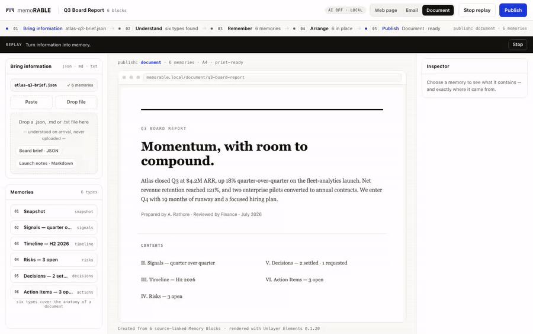
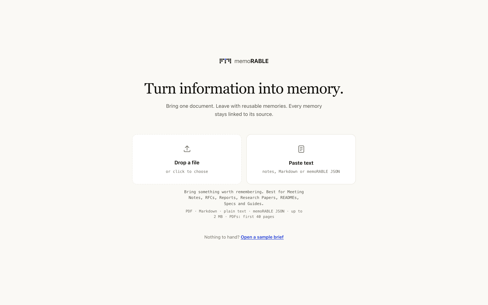
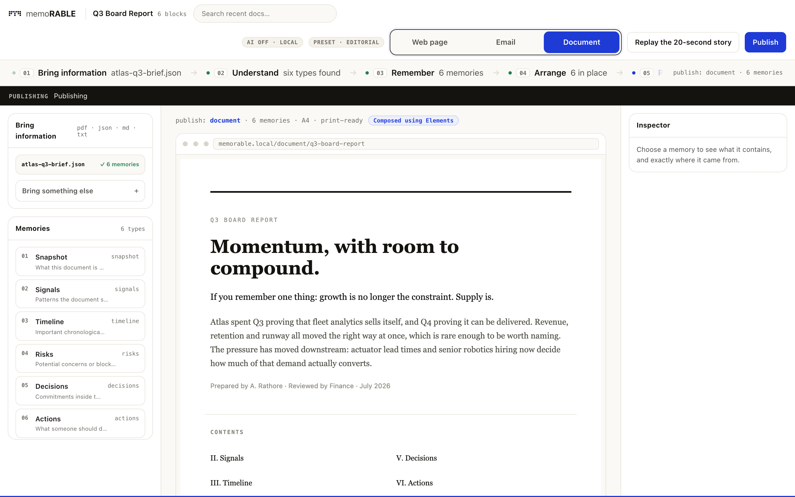
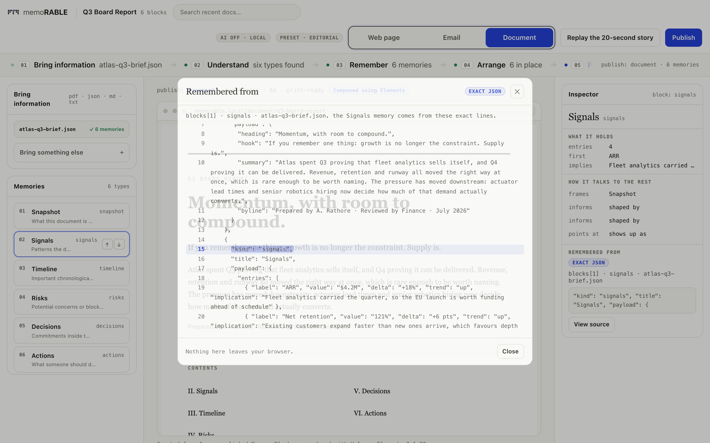
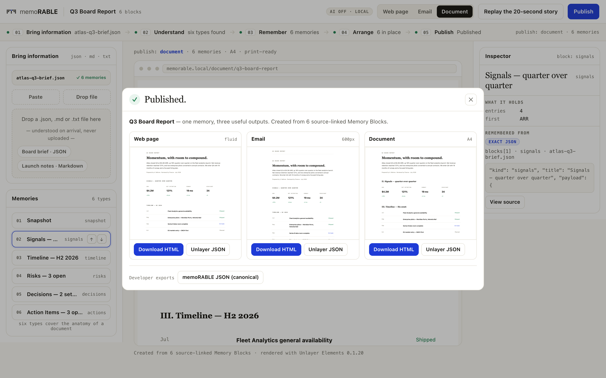

# memoRABLE

**Turn information into memory.**

Bring one document. Leave with reusable memories. Every memory stays linked to its source. Those memories are composed into Email, Web and Document with [Unlayer Elements](https://github.com/unlayer/elements).



**[Live demo →](https://memo-rable.vercel.app)** — no install, Atlas already remembered.

## Why memoRABLE exists

Documents are easy to store and hard to remember. Traditional summarization loses context. People need reusable, traceable knowledge — not another summary that drifts from the source.

memoRABLE reads your document once and *remembers* it as six source-linked Memory Blocks: Snapshot, Signals, Decisions, Timeline, Risks, Actions. Every memory knows exactly where it came from. From that single memory graph it publishes Web, Email and Document — three surfaces that can never disagree.

Nothing is uploaded. Understanding happens locally and deterministically. AI is optional and off by default.

## Why Elements?

Elements is the composition engine.

Extracted memories become structured React trees built with [`@unlayer/react-elements`](https://github.com/unlayer/elements). Those same trees render to:

- **Email** — 600px, Outlook-safe
- **Web** — full-bleed page
- **Document** — print-ready A4

One understanding. Multiple outputs. Same memory graph. Different publications.

```tsx
// src/render/build-root.tsx — Document output
<Document backgroundColor={colors.paper} contentWidth="760px" fontFamily={fonts.serif} textColor={colors.ink}>
  {cover}
  {contents}
  {blockRows}   {/* one or more Rows per Memory Block */}
  {footer}
</Document>
```

```ts
// src/render/render-bundle.ts — one tree, both exporters, per mode
base.html = renderToHtml(built.root);
const json = renderToJson(built.root);
```

## The five verbs

| Verb | What happens |
| --- | --- |
| **Bring** | Drop PDF / Markdown / text / JSON, or paste. PDFs: first 40 pages. Nothing is uploaded. |
| **Understand** | Strict JSON import or a conservative local text parser. No AI by default. |
| **Remember** | Exactly six Memory Blocks, each with provenance (*Remembered from*). |
| **Arrange** | Reorder memories. Ids, provenance and content hashes survive. |
| **Publish** | Ends on **"Published."** — Web, Email, Document, downloadable as HTML / PDF / Word + Unlayer JSON. |

## 20-second walkthrough

1. **Bring** a PDF, Markdown, notes or JSON — or open the sample brief.
2. Watch **Reading → Understanding → Remembering → Arranging → Publishing**.
3. Click a memory → the source scrolls and highlights the exact lines. Hover soft-highlights.
4. Switch Email / Web / Document — each says **Composed using Elements**.
5. **Publish** — three outputs side by side.









Press **Replay the 20-second story** to watch the real import pipeline run live.

## Architecture

```
Document (PDF / MD / text / JSON)
  ↓
Memory Extraction (local, deterministic)
  ↓
Memory Graph (6 grounded blocks)
  ↓
Elements Composition Engine
  ↓
Email · Web · Document
```

- **Deterministic core.** Optional AI (`ENABLE_AI=true`) only *improves* a local result.
- **Grounding as the demo.** Click → source scroll → paragraph + sentence highlight → memory pulse.
- **Reliability.** All-or-nothing JSON, last-good per mode, renderer fault isolation, sandboxed iframes, CSP.

Docs: [architecture](docs/architecture.md) · [reliability](docs/reliability.md) · [design principles](docs/design-principles.md) · [why memory](docs/why-memory.md)

## Key features

- Grounded memories with source traceability
- Elements composition (visible in the product UI)
- Multi-format publishing (Email / Web / Document)
- Memory-first UX (Bring → Understand → Remember → Arrange → Publish)
- PDF upload (first 40 pages remembered)
- Local-first — nothing leaves the browser by default

## Technical stack

Next.js 15 · React 19 · TypeScript · Zod · `@unlayer/react-elements` · pdf.js (client PDF text) · Vitest · Playwright

## Local development

Requires **Node 20.9–24** (`.nvmrc` pins 22).

```bash
nvm use
npm install
npm run dev          # http://localhost:3000

npm run verify       # lint + typecheck + tests + production build
npm run test:e2e     # Playwright (first run: npx playwright install chromium)
```

## Demo script (≈2 minutes)

1. **Problem** — documents get retyped into email, status page, slide; truth drifts.
2. **Bring** — drop a brief (or open the sample). Show Reading → Remembering stages.
3. **Click a memory** — source scrolls, highlight appears: “this came from HERE.”
4. **Elements** — point at *Powered by Elements* and switch Email / Web / Document.
5. **Publish** — three outputs, same memories. Close on: *Memory Engine built around Elements.*

## Future work

- Richer PDF layout awareness (tables / multi-column)
- Optional persisted memory library across visits
- Deeper Elements design-tool round-trip

## License

MIT — © 2026 Charan Rathore. See [LICENSE](LICENSE).
