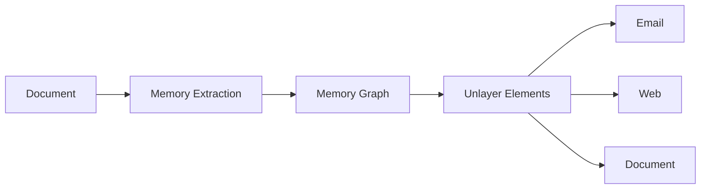

# memoRABLE

**Turn information into memory.**

**[Live demo →](https://memo-rable.vercel.app)** — open a sample brief, or tap **Watch the 1-minute demo**.


[▶ 1-minute demo with audio (MP4)](public/media/demo.mp4) · [WebM](public/media/demo.webm) · [Download MP4](https://github.com/charan-rathore/memoRABLE/raw/main/public/media/demo.mp4)

---

## Why does this exist?

Documents are easy to **store** and hard to **remember**.

A board brief gets pasted into email, retyped into a status page, then rewritten again for a slide. Facts drift. Context disappears. “Summarize this PDF” tools make another blob of text — still ungrounded, still one-format, still easy to mistrust.

People don’t need another summary.  
They need **reusable knowledge** that stays tied to the source and can leave as Email, Web, or Document without being rewritten.

That’s why memoRABLE exists.

---

## What is the product?

memoRABLE is a **Memory Engine**.

1. **Bring** one document (PDF, Markdown, plain text, or JSON).
2. **Remember** it as six source-linked Memory Blocks:  
   Snapshot · Signals · Timeline · Decisions · Risks · Actions
3. **Ground** every memory — click it, and the exact source lines highlight.
4. **Publish** once with [Unlayer Elements](https://github.com/unlayer/elements) into Email, Web, and Document.

One understanding. Three publications. Same memory graph.  
Nothing is uploaded by default. AI is optional and off unless you turn it on.

---

## Why should people use it?

| If you… | memoRABLE gives you… |
| --- | --- |
| Rewrite the same brief into email + docs + web | One memory → three outputs that can’t disagree |
| Don’t trust AI summaries | Provenance: *Remembered from* the exact lines |
| Need Elements to be obvious in a demo | UI says **Powered by Elements** / **Composed using Elements** |
| Care about privacy | Local-first by default |
| Work with PDFs and notes | Drop a file or paste — PDFs: first 40 pages |

```text
Document → Memory Extraction → Memory Graph (6 blocks) → Unlayer Elements → Email · Web · Document
```

---

## Try it

1. Open **[memo-rable.vercel.app](https://memo-rable.vercel.app)**.
2. Click **Watch the 1-minute demo** (video + sound, or silent GIF), **or**
3. Click **Open a sample brief** / drop your own file.
4. Click a memory → source highlights.
5. Switch Email / Web / Document → **Publish**.

---

## Setup (local)

**Need:** Node **20.9–24** (`.nvmrc` pins 22).

```bash
git clone https://github.com/charan-rathore/memoRABLE.git
cd memoRABLE

nvm use                 # or: nvm install 22 && nvm use 22
npm install
npm run dev             # → http://localhost:3000
```

| Command | What it does |
| --- | --- |
| `npm run dev` | Local app |
| `npm run verify` | Lint + types + tests + production build |
| `npm run test:e2e` | Playwright (`npx playwright install chromium` once) |
| `npm run demo:video` | Regenerate `public/media/demo.mp4` + GIF |

---

## Architecture



[architecture](docs/architecture.md) · [why memory](docs/why-memory.md) · [reliability](docs/reliability.md)

---

## Stack

Next.js 15 · React 19 · TypeScript · Zod · [`@unlayer/react-elements`](https://github.com/unlayer/elements) · pdf.js · Vitest · Playwright

---

## License

MIT — © 2026 Charan Rathore. See [LICENSE](LICENSE).
